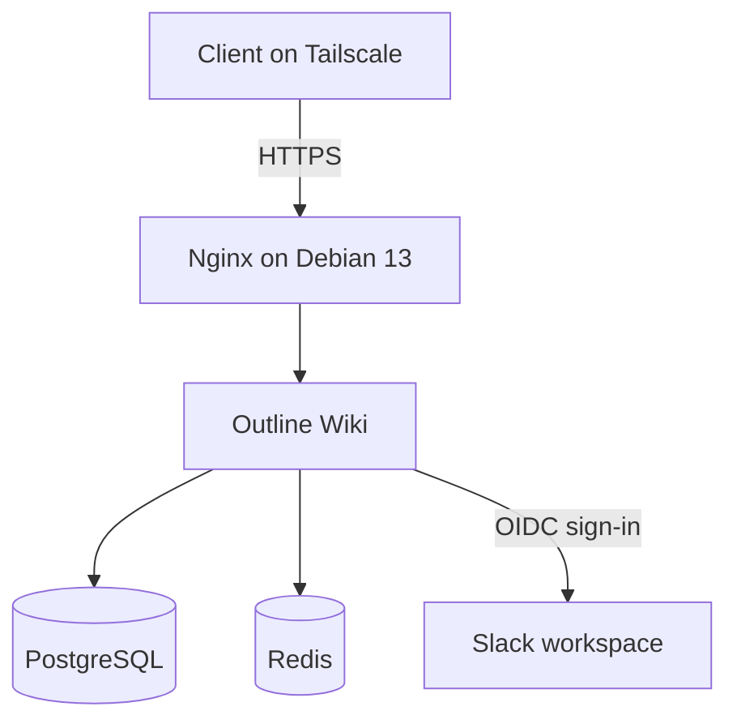
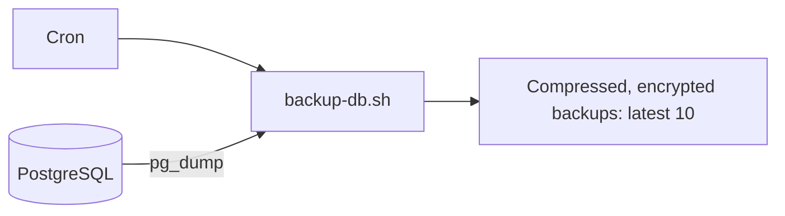

# Self-hosted Outline Wiki

This repository runs Outline on my Debian 13 homelab server. Docker Compose starts Outline, PostgreSQL, and Redis; Nginx serves HTTPS with a self-signed certificate. Sign-in uses Slack OIDC. The server is reachable through Tailscale at `https://outline.liadev`.

## Architecture

### Access and services

### Database backups

## Guide 1: Access my running server

1. Alex, ping me for **Tailscale access**, the **public certificate** (`outline.liadev.crt`), and access to the **Slack workspace** used for Outline sign-in.
2. Connect your computer to Tailscale. Download this repository and place the certificate at `nginx/certs/outline.liadev.crt`. 
3. Run the script from the repository root:

   - Debian/Ubuntu: `sudo ./scripts/setup-cert-debian.sh`
   - macOS: `sudo ./scripts/setup-cert-macos.sh`

   The script trusts the certificate and maps `outline.liadev` to the server in `/etc/hosts`.
4. Open `https://outline.liadev` and sign in with Slack.

**Certificate note:** The current generation script does not add `outline.liadev` to the certificate's Subject Alternative Name. Correct the script and regenerate the certificate before sharing it with new clients.

## Guide 2: Host your own instance

1. Install Docker, Docker Compose, and OpenSSL on a server. Clone this repository and run `cp .env.example .env`.
2. Edit `.env`: set the public `URL`, PostgreSQL credentials (including a matching `DATABASE_URL`), and a strong `BACKUP_ENCRYPTION_KEY`. Keep `.env` private.
3. Create a Slack OIDC app for your workspace, configure its Outline sign-in redirect, and put its client ID and secret in `.env`.
4. Set your hostname consistently in `.env`, `nginx/nginx.conf`, and `scripts/generate-certs.sh`. Set your server's IP in the relevant `scripts/setup-cert-*.sh` file. The generated certificate must include the exact hostname in its Subject Alternative Name; the current generator omits `DNS:outline.liadev`, so correct that before using it for this hostname.
5. Run `./scripts/generate-certs.sh`, then `docker compose up -d`. On each client, connect to the server's network, copy over the **public** `.crt` file, and run the appropriate certificate setup script as in Guide 1.
6. Schedule `./scripts/backup-db.sh` with cron on the server. For a daily 02:00 backup, add `0 2 * * * /absolute/path/to/project/scripts/backup-db.sh` with `crontab -e`. The cron user needs permission to run Docker.

## Project scripts and data

| Item | Purpose |
| --- | --- |
| `scripts/backup-db.sh` | Dumps PostgreSQL, compresses and encrypts the backup in `backups/`, and keeps the newest 10. |
| `scripts/restore-db.sh` | Stops Outline, replaces the database with the latest backup, then starts Outline again. |
| `scripts/generate-certs.sh` | Creates the self-signed certificate and private key in `nginx/certs/`. |
| `scripts/setup-cert-*.sh` | Trusts the public certificate and adds the hostname to `/etc/hosts` on Debian-based Linux or macOS. |

PostgreSQL and Redis store data in local `postgres-data/` and `redis-data/` directories. Restoring a backup replaces the current PostgreSQL database; run the restore script on the server only when you intend to roll back to the latest backup.
