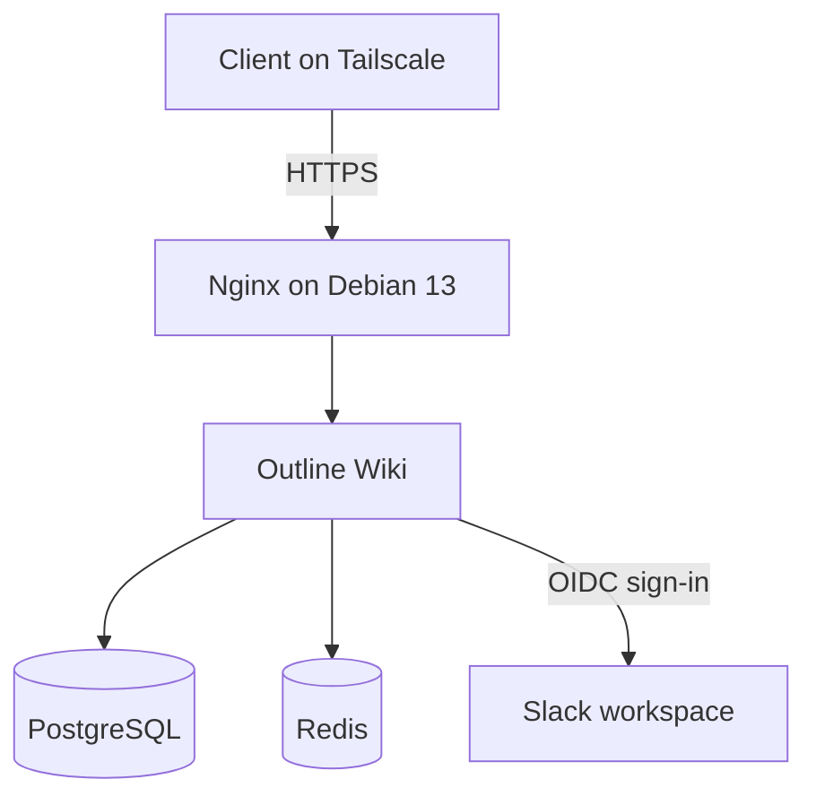
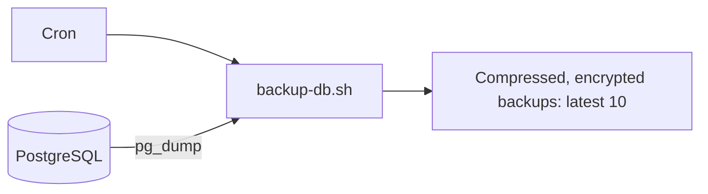

# Outline Wiki on my homelab

I run Outline on a Debian 13 server, with PostgreSQL, Redis, and Nginx in Docker Compose. Nginx serves the site over HTTPS using a self-signed certificate. Access is through Tailscale at `https://outline.liadev`, and sign-in uses my Slack workspace.

## How it's set up

Backups are made separately from the running services:

## Connecting to my server

Alex, ask me for Tailscale access, the public certificate (`outline.liadev.crt`), and access to the Slack workspace.

Once you're connected to Tailscale, clone this repository and put the certificate at `nginx/certs/outline.liadev.crt`. From the repository root, run the setup script for your computer:

- Debian or Ubuntu: `sudo ./scripts/setup-cert-debian.sh`
- macOS: `sudo ./scripts/setup-cert-macos.sh`

The script trusts the certificate and adds `outline.liadev` to `/etc/hosts`. You can then open `https://outline.liadev` and sign in with Slack.

## Running your own instance

1. Install Docker, Docker Compose, and OpenSSL, then clone this repository.
2. Copy `.env.example` to `.env`. Set the URL, database credentials, Slack OIDC credentials, and encryption keys. Make sure `DATABASE_URL` matches the PostgreSQL settings, and keep `.env` private.
3. Create a Slack OIDC app for your workspace and configure its Outline sign-in redirect.
4. Replace `outline.liadev` with your hostname in `.env`, `nginx/nginx.conf`, and `scripts/generate-certs.sh`. Update the server IP in the appropriate `scripts/setup-cert-*.sh` file.
5. Run `./scripts/generate-certs.sh`, then `docker compose up -d`. Give each client the public `.crt` file and run its certificate setup script.

The certificate generator includes the configured hostname in the certificate's Subject Alternative Name. If you change the hostname, generate a new certificate before setting up clients.

## Backups and restore

`scripts/backup-db.sh` dumps PostgreSQL, compresses and encrypts the dump, and keeps the 10 newest backups in `backups/`. To run it every day at 02:00, add this entry with `crontab -e`:

`0 2 * * * /absolute/path/to/project/scripts/backup-db.sh`

The cron user needs permission to run Docker.

`scripts/restore-db.sh` restores the newest backup. It stops Outline and replaces the current PostgreSQL database, so run it on the server only when you intend to roll back. PostgreSQL and Redis keep their local data in `postgres-data/` and `redis-data/`.
